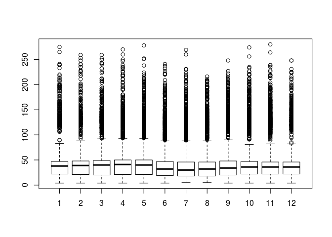
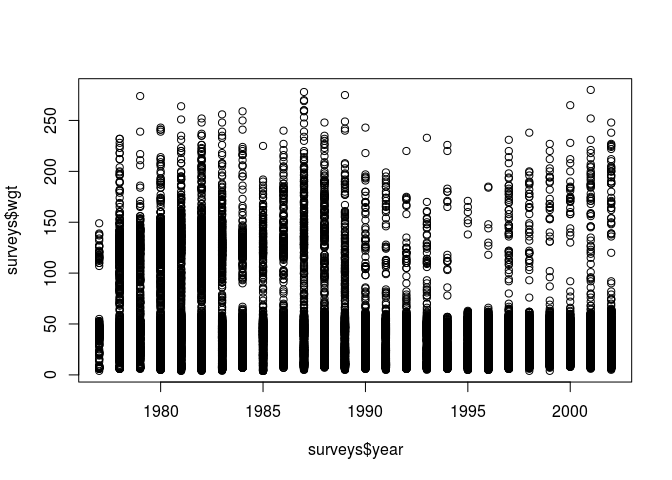
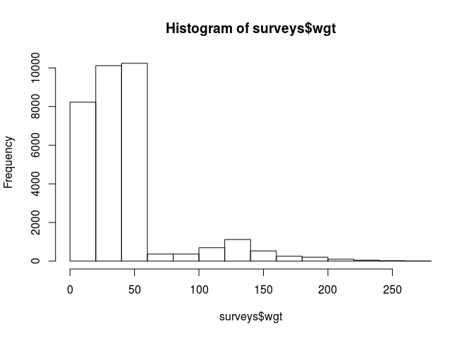
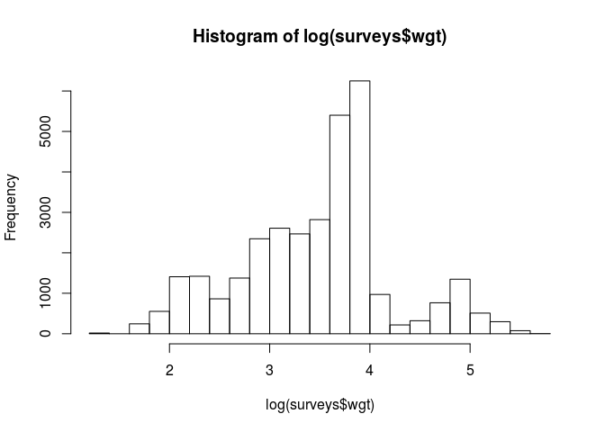
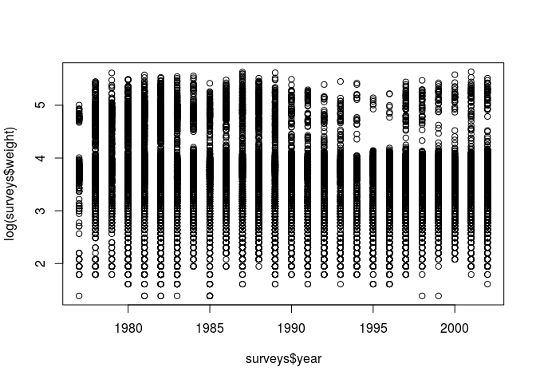
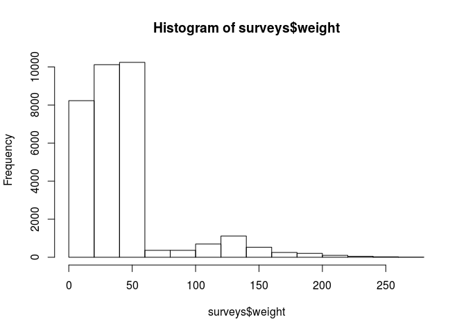

-   [Comments](#comments)
-   [\[1\] 253.75](#section)
    -   [A simple data frame](#a-simple-data-frame)
    -   [Loading data into R](#loading-data-into-r)
    -   [The data](#the-data)
    -   [Read in your data](#read-in-your-data)
    -   [Viewing data frames](#viewing-data-frames)
    -   [Additional Information](#additional-information)
    -   [Types of Vectors](#types-of-vectors)
-   [&gt; List of 1](#list-of-1)
-   [&gt; $ a: num 1](#a-num-1)
-   [&gt; List of 2](#list-of-2)
-   [&gt; $ a: num 1](#a-num-1-1)
-   [&gt; $ b: NULL](#b-null)
    -   [Selecting rows based on a condition](#selecting-rows-based-on-a-condition)
    -   [Saving figures](#saving-figures)
    -   [Additional resources and references](#additional-resources-and-references)

R is a programming language that we will interact with through RStudio. We are using RStudio server in a browser window in order to connect with other services at SESYNC, but most of what we will cover also applies to the RStudio program that runs as a standalone program on your computer.

Anatomy of RStudio

-   Console
-   Environment
-   Open a new file (R script) in the top left panel
-   Files/plots/help tabs in lower right

Type into the console at the `>` prompt to get a response like a calculator

``` r
1+2
```

    ## [1] 3

Using a programming language like R, you can record the steps of your analysis by saving them in a file. Run sections of code from the script panel by:

-   highlighting that section of code and clicking "Run"
-   Using cmd/ctrl (mac/pc) and Enter, which will run the line of code where your cursor is

### Comments

Any line that starts with a `#` is not run by the computer, but is a great way to explain the steps of the analsysis you are doing

``` r
# this is the beginning of my analysis
1 + 2
```

    ## [1] 3

We can create a list of numbers, called a **vector**, by combining them together using `c()`. If the numbers are all in order, the `:` is a short-cut to not need to type them all out.

``` r
c(3,4,5,6,7)
```

    ## [1] 3 4 5 6 7

``` r
c(3:7)
```

    ## [1] 3 4 5 6 7

Store your vector by giving it a name and using the **assignment operator** `<-`. Then you can refer to the items in that list by using its name. Use bracket notation to refer to a selected item or selection of items in that list.

``` r
mynumbers <- c(1:10) # store vector with assignment operator
mynumbers
```

    ##  [1]  1  2  3  4  5  6  7  8  9 10

``` r
mynumbers[3]
```

    ## [1] 3

Q: Store the first and last numbers of your vector in a new object.

**Review**

Symbol | Meaning | | -------|---------| | `?` | help | | `c()` | combine | | `#` | comment | | `:` | sequence | | `<-` | assignment | | `[ ]` | selection | **Getting help** There are many ways to get help with R and RStudio, including functionality built into the program. Search using the help tab on the lower right, or use the question mark function. Let's see if there is an easy way to find the mean of a sequence of numbers

``` r
?mean
```

`mean` is an example of a function in R. The help documentation shows an example usage with the name of the function, an open parenthesis, x, and a close parenthesis. (Let's ignore the ellipsis for now.)

Q: Use the function mean to get the average of this list of numbers: 387, 964, 14, -350 (put numbers on etherpad)

``` r
x <- c(387,964,14,-350)
mean(x)
```

    ## [1] 253.75

\[1\] 253.75
============

### A simple data frame

To store information alongside those values, we could combine `x` with a vector of names associated with each one of the values. Just as before, make a vector using `c()` but be sure to put each item in the list in quotes. This means it will be interpreted as a **string** or word, instead of a variable.

``` r
animals <- c("pig", "dog", "cat", "bunny") 
```

Combine `x` and `animals` into a **data frame** with the aptly named function `data.frame()`. Note the period between the words. Store your data frame as an object called `mydata`.

``` r
mydata <- data.frame(animals, x)
mydata
```

    ##   animals    x
    ## 1     pig  387
    ## 2     dog  964
    ## 3     cat   14
    ## 4   bunny -350

animals | x | |---------|----| | pig | 387 | | dog | 964 | | cat | 14 | | bunny | -350 | Q: How many rows and columns are in your data?

Another helpful function to know about is `str()` for structure. Easily find out information about each of the objects in your environment with the `str` function.

``` r
str(mydata)
```

    ## 'data.frame':    4 obs. of  2 variables:
    ##  $ animals: Factor w/ 4 levels "bunny","cat",..: 4 3 2 1
    ##  $ x      : num  387 964 14 -350

Q: Where else can you find this information easily?

-   In the Environment window
-   Opening up the objects in the viewer

### Loading data into R

Now let's ingest your data into R in a way that makes it easy to work with. Data could live on a disk, in a database, or on the web. Our focus right now is when data lives on a disk. We will move later into when data lives on a database or on the web.

The data
--------

This is data on a small mammal community in southern Arizona over the last 35 years. This is part of a larger project studying the effects of rodents and ants on the plant community. The rodents are sampled on a series of 24 plots, with different experimental manipulations of which rodents are allowed to access the plots.

This is a real dataset that has been used in over 100 publications. It's been simplified just a little bit for the workshop, but you can download the [full dataset](http://esapubs.org/archive/ecol/E090/118/) and work with it using exactly the same tools we'll learn about today.

Read in your data
-----------------

*put path to data folder on etherpad* The data are on SESYNC servers in a '/nfs/public-data/CSI2015/'

The data we are going to use is in a folder on the sesync storage space that you can access through RStudio. "public-data" is a folder just like many of you will have for your projects.

We will use the function `read.csv()` that reads in a file by passing it the location of the file. The general syntax for the functions to read in data are to give the path to the file name, and then supply optinal additional arguments as necessary like specifying column types. If you don't specify what argument you are giving it, R will use the defaults, which we will do for now.

``` r
read.csv(file="/nfs/public-data/CSI2015/plots.csv")
```

    ##    plot_id                 plot_type
    ## 1        1         Spectab exclosure
    ## 2        2                   Control
    ## 3        3  Long-term Krat Exclosure
    ## 4        4                   Control
    ## 5        5          Rodent Exclosure
    ## 6        6 Short-term Krat Exclosure
    ## 7        7          Rodent Exclosure
    ## 8        8                   Control
    ## 9        9         Spectab exclosure
    ## 10      10          Rodent Exclosure
    ## 11      11                   Control
    ## 12      12                   Control
    ## 13      13 Short-term Krat Exclosure
    ## 14      14                   Control
    ## 15      15  Long-term Krat Exclosure
    ## 16      16          Rodent Exclosure
    ## 17      17                   Control
    ## 18      18 Short-term Krat Exclosure
    ## 19      19  Long-term Krat Exclosure
    ## 20      20 Short-term Krat Exclosure
    ## 21      21  Long-term Krat Exclosure
    ## 22      22                   Control
    ## 23      23          Rodent Exclosure
    ## 24      24          Rodent Exclosure

Remember to use the assignment operator "&lt;-" to store that data in memory and work with it

``` r
plots <- read.csv(file="/nfs/public-data/CSI2015/plots.csv")
surveys <- read.csv(file="/nfs/public-data/CSI2015/surveys.csv")
```

Viewing data frames
-------------------

There are several ways to look at the data \* use head() to show the beginning rows of the data frame \* navigate in Environment window \* open csv by clicking on name in file browser (if in current working directory)

``` r
head(surveys)
```

    ##   record_id month day year plot species sex wgt
    ## 1         1     7  16 1977    2    <NA>   M  NA
    ## 2         2     7  16 1977    3    <NA>   M  NA
    ## 3         3     7  16 1977    2      DM   F  NA
    ## 4         4     7  16 1977    7      DM   M  NA
    ## 5         5     7  16 1977    3      DM   M  NA
    ## 6         6     7  16 1977    1      PF   M  NA

``` r
head(plots)
```

    ##   plot_id                 plot_type
    ## 1       1         Spectab exclosure
    ## 2       2                   Control
    ## 3       3  Long-term Krat Exclosure
    ## 4       4                   Control
    ## 5       5          Rodent Exclosure
    ## 6       6 Short-term Krat Exclosure

Additional Information
----------------------

Some basic math functions in R

``` r
*, +, -, /, ^, %%, %/%
abs, sign
acos, asin, atan, atan2
sin, cos, tan
ceiling, floor, round, trunc, signif
exp, log, log10, log2, sqrt

max, min, prod, sum
cummax, cummin, cumprod, cumsum, diff
pmax, pmin
range
mean, median, cor, sd, var
rle
```

\# Data types in R

After reading in the Surveys and Plots csv files, let's explore what types of data are in each column and what kind of structure your data has. There are several ways to do this in RStudio.

### Get quick overview

Some handy functions to get a quick idea of your data:

| function | returns              |
|----------|----------------------|
| dim      | dimensions           |
| nrow     | number of rows       |
| ncol     | number of columns    |
| names    | (column) names       |
| str      | structure            |
| summary  | summary info         |
| head     | shows beginning rows |

``` r
str(plots)
```

    ## 'data.frame':    24 obs. of  2 variables:
    ##  $ plot_id  : int  1 2 3 4 5 6 7 8 9 10 ...
    ##  $ plot_type: Factor w/ 5 levels "Control","Long-term Krat Exclosure",..: 5 1 2 1 3 4 3 1 5 3 ...

``` r
summary(plots)
```

    ##     plot_id                          plot_type
    ##  Min.   : 1.00   Control                  :8  
    ##  1st Qu.: 6.75   Long-term Krat Exclosure :4  
    ##  Median :12.50   Rodent Exclosure         :6  
    ##  Mean   :12.50   Short-term Krat Exclosure:4  
    ##  3rd Qu.:18.25   Spectab exclosure        :2  
    ##  Max.   :24.00

``` r
str(surveys)
```

    ## 'data.frame':    35549 obs. of  8 variables:
    ##  $ record_id: int  1 2 3 4 5 6 7 8 9 10 ...
    ##  $ month    : int  7 7 7 7 7 7 7 7 7 7 ...
    ##  $ day      : int  16 16 16 16 16 16 16 16 16 16 ...
    ##  $ year     : int  1977 1977 1977 1977 1977 1977 1977 1977 1977 1977 ...
    ##  $ plot     : int  2 3 2 7 3 1 2 1 1 6 ...
    ##  $ species  : Factor w/ 48 levels "","AB","AH","AS",..: NA NA 13 13 13 23 22 13 13 23 ...
    ##  $ sex      : Factor w/ 6 levels "","F","M","P",..: 3 3 2 3 3 3 2 3 2 2 ...
    ##  $ wgt      : int  NA NA NA NA NA NA NA NA NA NA ...

``` r
summary(surveys)
```

    ##    record_id         month             day             year     
    ##  Min.   :    1   Min.   : 1.000   Min.   : 1.00   Min.   :1977  
    ##  1st Qu.: 8888   1st Qu.: 4.000   1st Qu.: 9.00   1st Qu.:1984  
    ##  Median :17775   Median : 6.000   Median :16.00   Median :1990  
    ##  Mean   :17775   Mean   : 6.474   Mean   :16.11   Mean   :1990  
    ##  3rd Qu.:26662   3rd Qu.: 9.000   3rd Qu.:23.00   3rd Qu.:1997  
    ##  Max.   :35549   Max.   :12.000   Max.   :31.00   Max.   :2002  
    ##                                                                 
    ##       plot         species      sex            wgt        
    ##  Min.   : 1.0   DM     :10596    : 2506   Min.   :  4.00  
    ##  1st Qu.: 5.0   PP     : 3123   F:15690   1st Qu.: 20.00  
    ##  Median :11.0   DO     : 3027   M:17348   Median : 37.00  
    ##  Mean   :11.4   PB     : 2891   P:    1   Mean   : 42.67  
    ##  3rd Qu.:17.0   RM     : 2609   R:    3   3rd Qu.: 48.00  
    ##  Max.   :24.0   (Other):12051   Z:    1   Max.   :280.00  
    ##                 NA's   : 1252             NA's   :3266

The data we read in are stored in a **data frame**. A data frame is the most common way of storing data in R, and if used systematically makes data analysis easier. Under the hood, a data frame is a list of equal-length vectors. This makes it a 2-dimensional structure, much like an Excel spreadsheet. This means that a data frame has names(), colnames(), and rownames(), although names() and colnames() are the same thing. The length() of a data frame is the length of the underlying list and so is the same as ncol(); nrow() gives the number of rows.

A data.frame is one of the most commonly used objects in R. Just think of a data.frame like a table, or a spreadsheet, with rows and columns and numbers, text, etc. in the cells. A very special thing about the data.frame in R is that it can handle multiple types of data - that is, each column can have a different type.

Each column in a data frame can be referred to using the `$` operator and the data frame name and the column name. `surveys$record_id` refers to the record\_id column in the surveys data frame.

Types of Vectors
----------------

There are four common types of atomic vectors: logical, integer, double (often called numeric), and character. There are two rare types: complex and raw. All elements of an atomic vector must be the same type, so when you attempt to combine different types they will be coerced to the most flexible type. Types from least to most flexible are: logical, integer, double, and character.

**Characters**

Character data (words) in base R is read in as a factor by default, ie. stored as integers. In read\_csv or readxl that is not the default (but you can specify the column types if you want, or convert to factors with as.factor())

In surveys table, what is the difference between an NA in the species column vs NA in the wgt column?

``` r
head(surveys)
```

    ##   record_id month day year plot species sex wgt
    ## 1         1     7  16 1977    2    <NA>   M  NA
    ## 2         2     7  16 1977    3    <NA>   M  NA
    ## 3         3     7  16 1977    2      DM   F  NA
    ## 4         4     7  16 1977    7      DM   M  NA
    ## 5         5     7  16 1977    3      DM   M  NA
    ## 6         6     7  16 1977    1      PF   M  NA

You can specify what indicates missing data in the read.csv or read\_csv functions using either na.strings = "NA" or na = "NA". You can also specify multiple things to be interpreted as missing values, such as na = c("missing", "no data", "&lt; 0.05 mg/L", "XX")

**Numbers and integers**

Most of the rows in the surveys data frame are numbers and integers. Data that are strictly positive whole numbers are stored as integers.

**Factors**

A factor is a vector that can contain only predefined values, and is used to store categorical data. Factors are built on top of integer vectors using two attributes: the class(), “factor”, which makes them behave differently from regular integer vectors, and the levels(), which defines the set of allowed values.

We can make a column a factor with the as.factor() function. Use `as.factor()` to change the month column to a factor and see how the result of the summary function changes

``` r
surveys$month <- as.factor(surveys$month)
summary(surveys)
```

    ##    record_id         month            day             year     
    ##  Min.   :    1   7      : 3633   Min.   : 1.00   Min.   :1977  
    ##  1st Qu.: 8888   4      : 3443   1st Qu.: 9.00   1st Qu.:1984  
    ##  Median :17775   3      : 3390   Median :16.00   Median :1990  
    ##  Mean   :17775   5      : 3073   Mean   :16.11   Mean   :1990  
    ##  3rd Qu.:26662   10     : 3064   3rd Qu.:23.00   3rd Qu.:1997  
    ##  Max.   :35549   11     : 3016   Max.   :31.00   Max.   :2002  
    ##                  (Other):15930                                 
    ##       plot         species      sex            wgt        
    ##  Min.   : 1.0   DM     :10596    : 2506   Min.   :  4.00  
    ##  1st Qu.: 5.0   PP     : 3123   F:15690   1st Qu.: 20.00  
    ##  Median :11.0   DO     : 3027   M:17348   Median : 37.00  
    ##  Mean   :11.4   PB     : 2891   P:    1   Mean   : 42.67  
    ##  3rd Qu.:17.0   RM     : 2609   R:    3   3rd Qu.: 48.00  
    ##  Max.   :24.0   (Other):12051   Z:    1   Max.   :280.00  
    ##                 NA's   : 1252             NA's   :3266

**Logical data** (True or False)

Logical data is stored as either a 1 or 0, True or False. Logical vectors can be created using **logical operators**

| symbol | meaning                  |
|--------|--------------------------|
| &lt;   | less than                |
| &lt;=  | less than or equal to    |
| &gt;   | greater than             |
| &gt;=  | greater than or equal to |
| ==     | exactly equal to         |
| !=     | not equal to             |
| !x     | Not x                    |
| x      | y                        |
| x & y  | x AND y                  |

Make a new column with a logical data type based on some condition (e.g. whether the taxa was censused). Verify that is is logical (what are several ways to do this?)

``` r
plots$control <- plots$plot_type=="Control"
str(plots)
```

    ## 'data.frame':    24 obs. of  3 variables:
    ##  $ plot_id  : int  1 2 3 4 5 6 7 8 9 10 ...
    ##  $ plot_type: Factor w/ 5 levels "Control","Long-term Krat Exclosure",..: 5 1 2 1 3 4 3 1 5 3 ...
    ##  $ control  : logi  FALSE TRUE FALSE TRUE FALSE FALSE ...

``` r
class(plots$control)
```

    ## [1] "logical"

``` r
summary(plots)
```

    ##     plot_id                          plot_type  control       
    ##  Min.   : 1.00   Control                  :8   Mode :logical  
    ##  1st Qu.: 6.75   Long-term Krat Exclosure :4   FALSE:16       
    ##  Median :12.50   Rodent Exclosure         :6   TRUE :8        
    ##  Mean   :12.50   Short-term Krat Exclosure:4   NA's :0        
    ##  3rd Qu.:18.25   Spectab exclosure        :2                  
    ##  Max.   :24.00

### Lists

Lists are different from vectors because their elements can be of any type, including lists. You construct lists by using list() instead of c()

c() will combine several lists into one. If given a combination of atomic vectors and lists, c() will coerce the vectors to lists before combining them. Compare the results of list() and c()

``` r
x <- list(list(1, 2), c(3, 4))
y <- c(list(1, 2), c(3, 4))
str(x)
```

    ## List of 2
    ##  $ :List of 2
    ##   ..$ : num 1
    ##   ..$ : num 2
    ##  $ : num [1:2] 3 4

``` r
str(y)
```

    ## List of 4
    ##  $ : num 1
    ##  $ : num 2
    ##  $ : num 3
    ##  $ : num 4

Lists are used to build up many of the more complicated data structures in R

Basic Manipulation of Data frames

R has powerful subsetting capabilities that can be accessed very concisely using square brackets. The square brackets work as follows: anything before the comma refers to the rows that will be selected, anything after the comma refers to the number of columns that should be returned.

### subsetting with brackets

Some ways to subset vectors with bracket notation \[\]

1.  **positive integers**: return elements at the specified positions
2.  **Negative integers**: omit elements at the specified positions
3.  **Logical vectors**: select elements where the corresponding logical value is TRUE
4.  **Nothing**: returns the original vector (more useful for dataframes)

Qs:

-   what happens combining positive and negative integers? (error)
-   what happens when logical vector is shorter than the vector being subset? (recycled)
-   A missing value in the index always yields a missing value in the output

### subsetting data frames

Fix each of the following common data frame subsetting errors:

plots\[plots$plot\_id = 4, \] plots\[-1:4, \] plots\[plots$plot\_id &lt;= 5\] plots\[plots$plot\_id == 4 | 6, \]

### Subsetting with $ and double brackets

-   There are two other subsetting operators: \[\[ and $. \[\[ is similar to \[, except it can only return a single value and it allows you to pull pieces out of a list. $ is a useful shorthand for \[\[ combined with character subsetting.

“If list x is a train carrying objects, then x\[\[5\]\] is the object in car 5; x\[4:6\] is a train of cars 4-6.” — @RLangTip

### Subsetting and assignment

All subsetting operators can be combined with assignment to modify selected values of the input vector.

With lists, you can use subsetting + assignment + NULL to remove components from a list. To add a literal NULL to a list, use \[ and list(NULL):

``` r
x <- list(a = 1, b = 2)
x[["b"]] <- NULL
str(x)
```

    ## List of 1
    ##  $ a: num 1

&gt; List of 1
==============

&gt; $ a: num 1
===============

``` r
y <- list(a = 1)
y["b"] <- list(NULL)
str(y)
```

    ## List of 2
    ##  $ a: num 1
    ##  $ b: NULL

&gt; List of 2
==============

&gt; $ a: num 1
===============

&gt; $ b: NULL
==============

Selecting rows based on a condition
-----------------------------------

Because it allows you to easily combine conditions from multiple columns, logical subsetting is probably the most commonly used technique for extracting rows out of a data frame.

subset() is a specialised shorthand function for subsetting data frames, and saves some typing because you don’t need to repeat the name of the data frame

Data frames are 2-dimensional and can contain heterogenous data like numbers in one column and categories in another. Other types of data in R can be described according to these categories

||Homogeneous | Heterogeneous| |----|----|---| |1d | Atomic vector | List| |2d | Matrix | Data frame | |nd | Array ||

\# Base plotting

Now we're going to go over some of the ways to make figures in base R. After lunch we'll cover some advanced plotting with ggplot2.

The plot() function is the most basic plotting function. It is polymorphic, ie. uses the input data to determine plot type.

### Scatterplots

basic syntax is plot(x, y) or plot(y ~ x)

``` r
plot(surveys$month, surveys$wgt)
```

<!-- -->

``` r
plot(surveys$year, surveys$wgt)
```

<!-- -->

``` r
plot(surveys$year, log(surveys$wgt))
```

<!-- -->

### Histograms

``` r
hist(surveys$wgt)
```

<!-- -->

``` r
hist(log(surveys$wgt))
```

<!-- -->

#### Boxplots

Use a boxplot to compare the number of species seen each year. We'll use another function from the lubridate package, year()

``` r
par(mfrow=c(1,1))
boxplot(surveys$wgt ~ surveys$year)
```

<!-- -->

``` r
boxplot(surveys$wgt ~ surveys$month)
```

<!-- -->

``` r
boxplot(log(surveys$wgt) ~ surveys$year)
```

<!-- -->

### Graphical parameters

-   adjust line types, plotting characters, cex, x and y labels
-   plot different factors/types in different colors

**Mulit-panel plots** Multi-panel plots can be made by changing the graphical parameters with the par() function.

``` r
surveys1990 <- subset(surveys, year == 1990)
surveys1996 <- subset(surveys, year == 1996)

par(mfrow=c(1,2))
hist(log(surveys1990$wgt))
hist(log(surveys1996$wgt))
```

<!-- -->

We know that the dates columns are exactly the same for the no\_species dataframe and the weights dataframe, so we can just add the Totalwgt column to the species dataframe. If the dates were different we might do a join.

Saving figures
--------------

You can save a plot by opening up a "graphics device" and writing the plot to a specified file. The general syntax is:

``` r
pdf(file="myfile.pdf", width=7, height=6, units="in")
plot(x, y)
dev.off()
```

Remember that by default your file will be saved in your working directory

-   pdf()
-   png()
-   postscript()

\# Custom functions

Functions enable easy reuse within a project, helping you not to repeat yourself. If you see blocks of similar lines of code through your project, those are usually candidates for being moved into functions.

If your calculations are performed through a series of functions, then the project becomes more modular and easier to change. This is especially the case for which a particular input always gives a particular output.

Three components of functions

-   **body**: the code inside the function
-   **arguments**: control how you can call the function

### Basic syntax of a function

A function needs to have a name, probably at least one argument (although it doesn’t have to), and a body of code that does something. At the end it usually should (although doesn’t have to) return an object out of the function. The important idea behind functions is that objects that are created within the function are local to the environment of the function – they don’t exist outside of the function. But you can “return” the value of the object from the function, meaning pass the value of it into the global environment.

``` r
myfunction <- function(x) {
  # do something to x here
  # return a value of interest
}
```

The base R language does not have a function to calculate the standard error of the mean. Since this is a common statistical value of interest, let's write a function to calculate the standard error. Recall that the standard error is calculated as the square root of the variance over the sample size.

First subset the surveys table to get rid of the values with `NA`. We'll use a handy function called `na.omit()`.

``` r
surveys <- na.omit(surveys)
```

The 3 functions needed for the standard error calculation are `sqrt` for square root, `var` for variance, and `length` for sample size. Calculate the standard error of the `wgt` column using these three functions.

``` r
sqrt(var(surveys$wgt)/length(surveys$wgt))
```

    ## [1] 0.1601575

When you might want to use a function: \* It is difficult to read - what is doing? \* There are large amounts of repeated code. \* When we want to change something, we need to do it in many places. \* The code adds lots of objects to the workspace. These are difficult to keep track of and make bugs more likely.

We can generalize the calculation that we made by storing it as a **function** called stderr. The calculation that we made above goes into the **body** of the function.

``` r
stderr <- function(x){
  # this function returns the standard error of the mean
  sqrt(var(x)/length(x))}
```

Q: Calculate the standard error of the mean for the subset of surveys done in 1990 Q: Calculate the standard error of the mean for all surveys done in the month of June

Additional resources and references
-----------------------------------

-   [Jenny Bryan's Stat 545 class materials index of topics](http://stat545-ubc.github.io/topics.html)
-   [keyboard shortcuts in RStudio](https://support.rstudio.com/hc/en-us/articles/200711853-Keyboard-Shortcuts)
-   [R Graph catalog](http://shiny.stat.ubc.ca/r-graph-catalog/)
