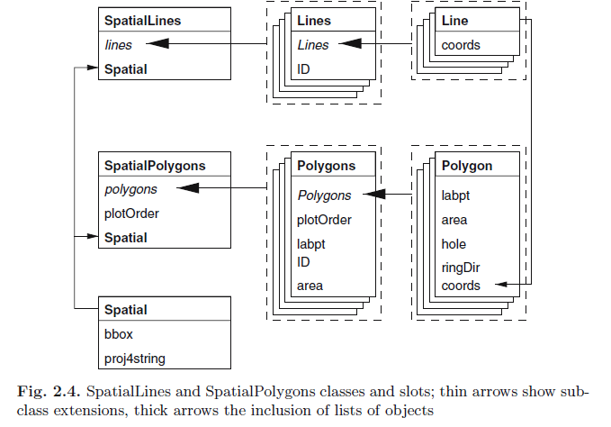
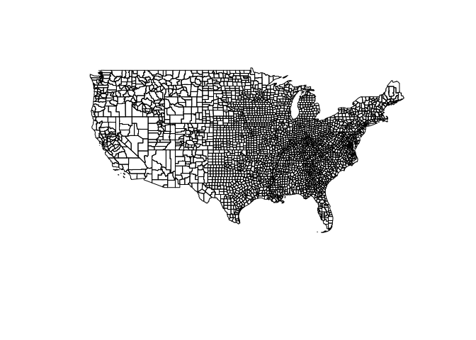
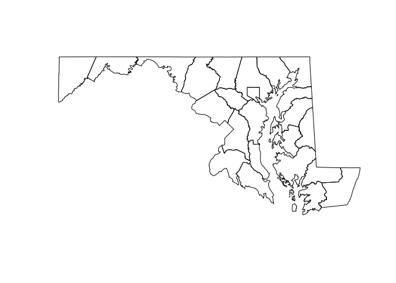
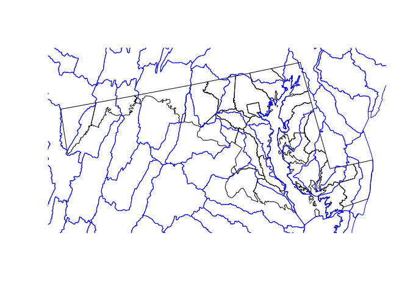
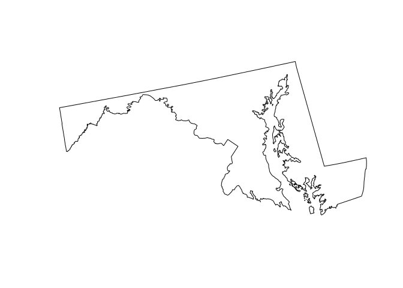
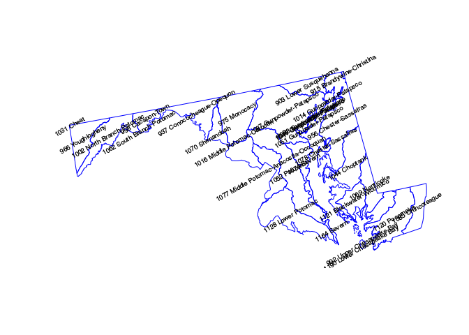
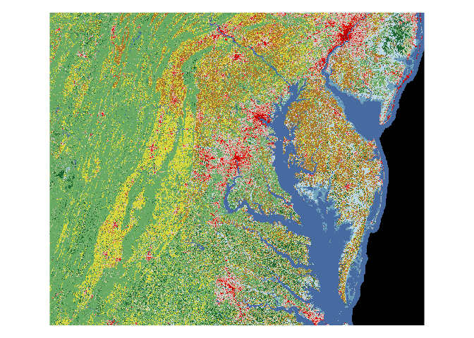
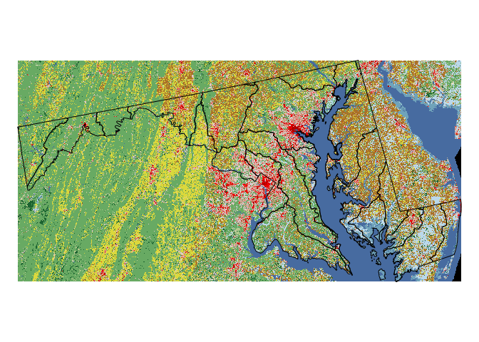
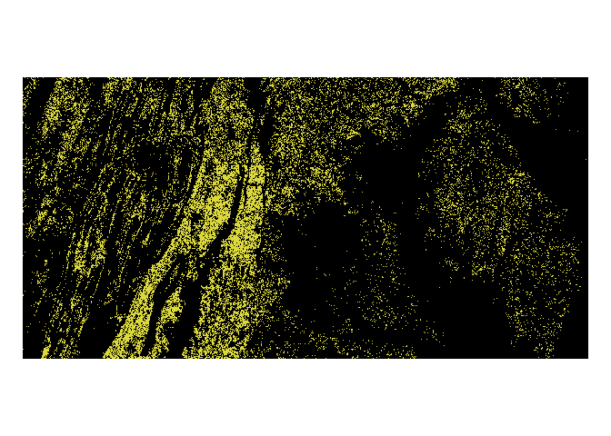
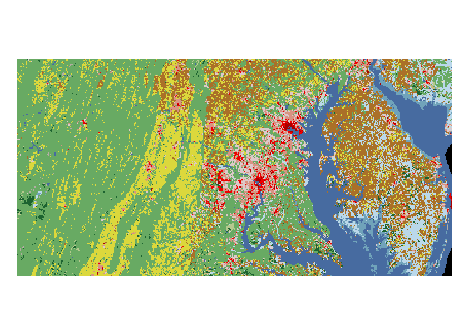

Geospatial analysis in R
========================

This lesson presents a brief overview of some of the key R packages for geospatial analysis. Specifically, we will learn how to perform the following spatial processing tasks in R:

-   [load and plot vector layers](#importing-vector-data) (points, lines and polygons);
-   [subset vector layers](#subsetting-vector-layers) based on associated data or on another layer (overlay);
-   read projections and [transform coordinates](#coordinate-transformations);
-   perform [geometric operations](#geometric-operations-on-vector-layers) (union, intersection and buffering) on polygon layers;
-   [load, subset and plot raster layers](#working-with-raster-data) (grids of pixels);
-   [filter (mask) and aggregate raster pixels](#raster-math);
-   [extract raster values](#the-extract-function) based on a vector layer.

The R scripting approach to geospatial analysis may initially seem inconvenient or unintuitive, compared to the point-and-click interface of GIS software. However, the additional effort of coding all the steps of an analysis workflow makes it much easier for anyone - including the code's author - to reproduce the same analysis on new or updated data. R scripts can also serve to automate and distribute large processing tasks in a high-performance computing environment (such as SESYNC's SLURM cluster).

Importing vector data
---------------------

We start by importing a layer of polygons corresponding to US counties. The data is available from the US Census website (<http://www2.census.gov/geo/tiger/GENZ2014/shp/cb_2014_us_county_500k.zip>), but we will load a local copy from the SESYNC server.

In the code below, we load two R packages: **sp** and **rgdal**. The former defines spatial data classes in R and is thus a prerequisite for most other spatial analyses packages; the latter is an interface to the open source Geospatial Data Abstraction Library (GDAL) that enables R to import spatial data stored in different file formats. Note that to use rgdal on your personal computer, you need to first [install GDAL](http://trac.osgeo.org/gdal/wiki/DownloadingGdalBinaries).

To import a .shp shapefile, we call the `readOGR` function from rgdal. This function takes at minimum two arguments, corresponding to the file location (`dsn`) and layer name (`layer`); in general, the layer name should match the filename without its extension.

``` r
library(sp)
library(rgdal)
cb_dir <- "/nfs/public-data/census-tiger-2013/cb_2014_us_county_500k"
counties <- readOGR(dsn = file.path(cb_dir, "cb_2014_us_county_500k.shp"),
                    layer = "cb_2014_us_county_500k", stringsAsFactors = FALSE)
```

    ## OGR data source with driver: ESRI Shapefile 
    ## Source: "/nfs/public-data/census-tiger-2013/cb_2014_us_county_500k/cb_2014_us_county_500k.shp", layer: "cb_2014_us_county_500k"
    ## with 3233 features
    ## It has 9 fields

Because each polygon in the shapefile has attached data, the resulting object is a *SpatialPolygonsDataFrame*. (Note that the `stringsAsFactors` argument we specified works the same as for regular data frames.) By exploring its structure in the RStudio Environment tab, we see that it contains a data frame (`counties@data`) and a list of polygons (`counties@polygons`). Although we cannot see the full object under Environment, you can type `counties@proj4string` or `counties@bbox` in the R console to see the layer's projection information and its bounding box, respectively. A *SpatialPolygons* object is a polygon layer with the same components, but no attached `@data`. Analogous classes exist for point (*SpatialPoints*, *SpatialPointsDataFrame*) and line (*SpatialLines*, *SpatialLinesDataFrame*) layers.

*Note*: The reason why we use "@" rather than "$" to access parts of this object has to do with object-oriented programming systems in R and is beyond the scope of this lesson. However, you can always look at the structure of an object, either with the `str()` function or in the RStudio Environment tab, to know which of the two characters applies.

Each of the *Polygons* object in a *SpatialPolygons* or *SpatialPolygonsDataFrame* contains one or more *Polygon* objects, which are simple polygons in the geometric sense; a single *Polygons* object can thus be a complex shape combining many polygons with holes in them. The `@coords` slot of a *Polygon* is a matrix with the (*x*,*y*) coordinates of each vertex, with the first and last vertices being identical to form a "closed" shape.



*Source: Bivand et al. (2013), Applied Spatial Data Analysis with R, p.40*

The diagram above summarizes the hierarchical structure of *SpatialPolygons* (and *SpatialLines*) objects. Although we will only deal with the full spatial objects in this lesson, understanding this structure is useful for more complex operations, e.g. when you need to apply a custom function on each individual polygon.

The spatial objects defined by the sp package are compatible with the base R `plot` function. We now plot the counties map, setting *x* and *y* limits to only display the continental US.

``` r
plot(counties, xlim = c(-125, -65), ylim = c(20, 50))
```



Instead of importing a shapefile, we can build spatial objects from coordinate matrices in R. Let's create a *SpatialPoints* object with a single point, corresponding to SESYNC's coordinates in decimal degrees.

``` r
sesync <- SpatialPoints(cbind(-76.505206, 38.9767231), 
                        proj4string = CRS(proj4string(counties)))
```

We joined the *x* and *y* values with `cbind` rather than `c` since the input coordinates must be a two-column matrix. We defined the new object's coordinate system to match that of *counties*. Note that the `CRS()` function (for coordinate reference system) is required to assign the proj4string of one object to another object.

When two spatial layers share the same coordinate system, they can be superposed on the same plot. The spatial version of `plot` accepts an `add` parameter to add a layer to the last plot. It also accepts standard R graphical parameters such as color (`col`) and point shape (`pch`).

``` r
plot(counties, xlim = c(-125, -65), ylim = c(20, 50))
plot(sesync, col = "green", pch = 20, add = TRUE)
```


Subsetting vector layers
------------------------

A *Spatial...DataFrame* can be subset with expressions in brackets, just like a regular R data frame.

``` r
counties_md <- counties[counties$STATEFP == "24", ]  # 24 is the FIPS code for Maryland
plot(counties_md)
```



The code above selects specific rows (corresponding to counties in Maryland) along with the polygons corresponding to those rows. In contrast, subsetting by columns would only affect the data frame component.

A spatial *overlay* operation can be seen as a type of subset based on spatial (rather than data) matching. It is implemented with the `over(sp1, sp2)` function in sp. The exact output depends on the type of layers being matched; if *sp1* is a *SpatialPoints* layer and *sp2* is a *SpatialPolygonsDataFrame*, the function finds the polygon(s), if any, containing each point in *sp1* and returns the corresponding rows of *sp2*.

``` r
over(sesync, counties_md)
```

    ##   STATEFP COUNTYFP COUNTYNS       AFFGEOID GEOID         NAME LSAD
    ## 1      24      003 01710958 0500000US24003 24003 Anne Arundel   06
    ##        ALAND    AWATER
    ## 1 1074549135 447837598

### Exercise

Produce a map of Maryland counties with Frederick County colored in red.

Coordinate transformations
--------------------------

For the next part of this lesson, we import a new polygon layer corresponding to the 1:250k map of US hydrological units (HUC) downloaded from the United States Geological Survey (<http://water.usgs.gov/GIS/dsdl/huc250k_shp.zip>).

``` r
huc <- readOGR(dsn = "../Geodata/huc250k.shp", layer = "huc250k", 
               stringsAsFactors = FALSE)
```

    ## OGR data source with driver: ESRI Shapefile 
    ## Source: "../Geodata/huc250k.shp", layer: "huc250k"
    ## with 2158 features
    ## It has 10 fields

While the counties data uses unprojected (longitude, latitude) coordinates, *huc* has an Albers equal-area projection (indicated as "+proj=aea").

``` r
proj4string(counties_md)
```

    ## [1] "+proj=longlat +datum=NAD83 +no_defs +ellps=GRS80 +towgs84=0,0,0"

``` r
proj4string(huc)
```

    ## [1] "+proj=aea +lat_1=29.5 +lat_2=45.5 +lat_0=23 +lon_0=-96 +x_0=0 +y_0=0 +datum=NAD27 +units=m +no_defs +ellps=clrk66 +nadgrids=@conus,@alaska,@ntv2_0.gsb,@ntv1_can.dat"

Other parameters differ between the two projections, such as the "datum", which indicates the standard by which the irregular surface of the Earth is approximated by an ellipsoid.

Fortunately, the rgdal package provides us with a generic function (`spTransform`) to convert spatial objects between any two coordinate systems expressed in standard proj4string notation. In the code below, we input a projection string (*proj1*) matching a different version of the Albers equal-area projection and transform both our polygons layers to that coordinate system. (We define this particular projection to match yet another data source that we will import later in this lesson.) This allows us to plot both layers on the same map.

``` r
proj1 <- "+proj=aea +lat_1=29.5 +lat_2=45.5 +lat_0=23 +lon_0=-96 +x_0=0 +y_0=0 +ellps=GRS80 +towgs84=0,0,0,0,0,0,0 +units=m +no_defs"
counties_md <- spTransform(counties_md, proj1)
huc <- spTransform(huc, proj1)
plot(counties_md)
plot(huc, add = TRUE, border = "blue")
```



Geometric operations on vector layers
-------------------------------------

The **rgeos** package, a R interface to the open source geometry engine GEOS (<http://trac.osgeo.org/geos/>), provides various functions to modify and transform the geometric objects in one or more vector layers.

The last map we produced in the previous section (MD counties and hydrological units) is rather hard to read. Let's consider the following improvements:

-   to reduce the number of lines, remove the county boundaries within the state;
-   crop the HUC layer to only show the parts of hydrological units contained within the state boundaries.

The first step is a spatial **union** operation: we want the resulting object to combine the area covered by all the *Polygons* in `counties_md`. To perform a union of all sub-geometries in a single spatial object, we use the rgeos `gUnaryUnion` function. (This differs from the `gUnion` function which returns the union of two spatial objects.)

``` r
library(rgeos)
state_md <- gUnaryUnion(counties_md)
plot(state_md)
```



The second step is a spatial **intersection**, since we want the resulting object to be limited to the areas covered by both *huc* and *state\_md*. The `byid = TRUE` argument indicates that the intersection should be performed separately for each polygon within *huc*; this way, the individual hydrological units are preserved but any part of them (or any whole polygon) lying outside the *state\_md* polygon is cut from the output. In the `id` argument, we specify meaningful labels for each resulting polygon, by pasting a unique number to the name of each hydrological unit from the original *huc* data. (Note that the result of `gIntersection` is a *SpatialPolygons* object with no attached data.)

``` r
huc_md <- gIntersection(huc, state_md, byid = TRUE, 
                        id = paste(1:length(huc), huc$HUC_NAME))
plot(huc_md, border = "blue")
text(coordinates(huc_md), labels = names(huc_md), cex = 0.6, srt = 30)
```



The rgeos package also includes functions to create a buffer of specific width around a geometry (`gBuffer`), to calculate the shortest distance between geometries (`gDistance`) and the area of polygons (`gArea`). Keep in mind however that all these functions use planar geometry equations and thus become less precise over larger distances, as the effect of the Earth's curvature become non-negligible. To calculate geodesic distances that account for that curvature, check the **geosphere** package.

### Exercise

Create a 5km buffer around the *state\_md* borders and plot it as a dotted line (`plot(..., lty = "dotted")`) on the same map. *Hint*: Check the layer's units with `proj4string()` and express any distance in those units.

Working with raster data
------------------------

While vector spatial layers are composed of geometrical objects defined by their vertices, raster layers are defined as grids of pixels with attached values. A raster can be seen as a data matrix with associated spatial properties (e.g. extent, resolution and projection) that allow its values to be mapped onto geographical space.

We start by loading the **raster** package in R and importing a raster file with the eponymous `raster` function. This file is a portion of the [National Land Cover Database](http://www.mrlc.gov/nlcd2011.php), which we already cropped and reduced to a lower resolution in order to speed up processing time for this tutorial.

``` r
library(raster)
nlcd <- raster("../Geodata/nlcd_agg.grd")
nlcd # show raster properties
```

    ## class       : RasterLayer 
    ## dimensions  : 2514, 3004, 7552056  (nrow, ncol, ncell)
    ## resolution  : 150, 150  (x, y)
    ## extent      : 1394535, 1845135, 1724415, 2101515  (xmin, xmax, ymin, ymax)
    ## coord. ref. : +proj=aea +lat_1=29.5 +lat_2=45.5 +lat_0=23 +lon_0=-96 +x_0=0 +y_0=0 +ellps=GRS80 +towgs84=0,0,0,0,0,0,0 +units=m +no_defs 
    ## data source : /nfs/pmarchand-data/Training/ci-spring2016/Geodata/nlcd_agg.grd 
    ## names       : nlcd_2011_landcover_2011_edition_2014_03_31 
    ## values      : 0, 95  (min, max)
    ## attributes  :
    ##         ID      COUNT Red Green Blue Land.Cover.Class Opacity
    ##  from:   0 7854240512   0     0    0     Unclassified       1
    ##  to  : 255          0   0     0    0                        0

``` r
plot(nlcd)
```



As shown in the code above, we can access the properties of a raster by simply typing its name in the console. By default, the whole raster is *not* loaded into working memory, as you can confirm by checking the R object size with `object.size(nlcd)`. This means that unlike most analyses in R, you can actually process raster datasets larger than the RAM available on your computer; the raster package automatically loads pieces of the data and computes on each of them in sequence.

The `crop` function crops a raster layer to a given spatial *extent* (range of *x* and *y* values). The extent can be extracted from another spatial object with `extent`. Here, we crop the *nlcd* raster to the extent of the *huc\_md* polygons, then display both layers on the same map.

``` r
nlcd <- crop(nlcd, extent(huc_md))
plot(nlcd)
plot(huc_md, add = TRUE)
```



Note that the transformed raster is now loaded in R memory, as indicated by the size of `nlcd`. We could have also saved the output to disk by specifying an optional `filename` argument to `crop`; the same is true for othe raster transformation functions.

A raster is fundamentally a data matrix, and individual pixel values can be extracted by regular matrix subscripting. For example, this returns the value of the bottom-left corner pixel:

``` r
nlcd[1,1]
```

    ##    
    ## 41

The meaning of this number is not immediately clear. For this particular dataset, the mapping of values to land cover classes is described in the data attributes:

``` r
str(nlcd@data@attributes)
```

    ## List of 1
    ##  $ :'data.frame':    256 obs. of  7 variables:
    ##   ..$ ID              : int [1:256] 0 1 2 3 4 5 6 7 8 9 ...
    ##   ..$ COUNT           : num [1:256] 7.85e+09 0.00 0.00 0.00 0.00 ...
    ##   ..$ Red             : num [1:256] 0 0 0 0 0 0 0 0 0 0 ...
    ##   ..$ Green           : num [1:256] 0 0.976 0 0 0 ...
    ##   ..$ Blue            : num [1:256] 0 0 0 0 0 0 0 0 0 0 ...
    ##   ..$ Land.Cover.Class: Factor w/ 18 levels "","Barren Land",..: 17 1 1 1 1 1 1 1 1 1 ...
    ##   ..$ Opacity         : num [1:256] 1 1 1 1 1 1 1 1 1 1 ...

We save the `Land.Cover.Class` column as a new vector in order to easily check the land cover type corresponding to any numeric value. Note however that we need to add 1 to the raster value, since these go from 0 to 255 whereas the indexing of a vector starts at 1.

``` r
lc_types <- nlcd@data@attributes[[1]]$Land.Cover.Class
lc_types[42]
```

    ## [1] Deciduous Forest
    ## 18 Levels:  Barren Land Cultivated Crops ... Woody Wetlands

Raster math
-----------

Basic mathematical operations in R are directly applicable to rasters. For example, `log(r1)` returns a new raster where each pixel's value is the log of the corresponding pixel in `r1`; `r1 + r2` creates a raster where each pixel is the sum of the values from `r1` and `r2` (provided their dimensions match), etc.

The same applies for logical operations: `r1 > 5` returns a logical raster with pixel values `TRUE` or `FALSE` depending on the value of the corresponding pixels in `r1`. Logical rasters are particularly useful with the `mask` function. The following code creates a new raster from `nlcd`, removing all pixels where the masking condition (`nlcd == 81`) is false (`maskvalue = FALSE`).

``` r
pasture <- mask(nlcd, nlcd == 81, maskvalue = FALSE)
plot(pasture)
```



The `cellStats` function calculates a summary statistic (e.g. `cellStats(r1, "mean")`) across the entire raster layer. Alternatively, we can `aggregate` values locally in a raster, for blocks of a given size, which produces a raster with a lower resolution.

``` r
nlcd_agg <- aggregate(nlcd, fact = 5, fun = modal)
nlcd_agg@legend <- nlcd@legend
plot(nlcd_agg)
```



Here, `fact = 5` means that we are aggregating blocks 5 x 5 pixels and `fun = modal` indicates that the aggregate value is the mode of the original pixels (averaging would not work since land cover is a categorical variable).

### Exercise

Which proportion of `nlcd` pixels are covered by deciduous forest (value = 41)? *Hint*: Use `cellStats`.

The extract function
--------------------

Finally, we look at the `extract` function, which allows subsetting and aggregation of raster values based on the vector spatial objects. When extracting by point locations (i.e. a *SpatialPoints* object), the result is a vector of values corresponding to each point.

``` r
sesync <- spTransform(sesync, proj1)
sesync_lc <- extract(nlcd, sesync)
lc_types[sesync_lc + 1]
```

    ## [1] Developed, Open Space
    ## 18 Levels:  Barren Land Cultivated Crops ... Woody Wetlands

When extracting with a polygon, the output is a vector of all raster values for pixels falling within that polygon.

``` r
huc_nlcd <- extract(nlcd, huc_md[1])
table(huc_nlcd)
```

    ## huc_nlcd
    ##    11    21    22    23    24    31    41    42    43    52    71    81 
    ##  1360  2402   220   152    42    57 12322   151   155   523    40  7067 
    ##    82    90    95 
    ##  7139   246    30

To get a summary of raster values for each polygon in a *SpatialPolygons*, we can add an aggregation function to `extract` via the `fun` argument. The following code calculates the most common land cover type (`fun = modal`) for each polygon in *huc\_md*.

``` r
modal_lc <- extract(nlcd_agg, huc_md, fun = modal)
modal_lc <- lc_types[modal_lc + 1]
data.frame(names(huc_md), modal_lc)
```

    ##                             names.huc_md.                      modal_lc
    ## 1                   903 Lower Susquehanna              Deciduous Forest
    ## 2                915 Brandywine-Christina                   Hay/Pasture
    ## 3               937 Conococheague-Opequon              Deciduous Forest
    ## 4                   956 Chester-Sassafras              Cultivated Crops
    ## 5                        966 Youghiogheny              Deciduous Forest
    ## 6                            975 Monocacy              Cultivated Crops
    ## 7                  987 Gunpowder-Patapsco              Deciduous Forest
    ## 8                992 Upper Chesapeake Bay                    Open Water
    ## 9                        998 Cacapon-Town              Deciduous Forest
    ## 10              1002 North Branch Potomac              Deciduous Forest
    ## 11                1014 Gunpowder-Patapsco Emergent Herbaceuous Wetlands
    ## 12           1016 Middle Potomac-Catoctin              Deciduous Forest
    ## 13                             1031 Cheat              Deciduous Forest
    ## 14                1038 Gunpowder-Patapsco                    Open Water
    ## 15                1040 Gunpowder-Patapsco Emergent Herbaceuous Wetlands
    ## 16                1041 Gunpowder-Patapsco                    Open Water
    ## 17                          1044 Choptank              Cultivated Crops
    ## 18                1051 Gunpowder-Patapsco                    Open Water
    ## 19                          1052 Patuxent              Deciduous Forest
    ## 20              1062 South Branch Potomac              Deciduous Forest
    ## 21                         1069 Nanticoke              Cultivated Crops
    ## 22                        1070 Shenandoah                    Open Water
    ## 23                            1074 Severn              Deciduous Forest
    ## 24 1077 Middle Potomac-Anacostia-Occoquan      Developed, Low Intensity
    ## 25                 1078 Chester-Sassafras                    Open Water
    ## 26                      1085 Chincoteague                    Open Water
    ## 27                          1120 Pocomoke                Woody Wetlands
    ## 28               1121 Blackwater-Wicomico              Cultivated Crops
    ## 29                     1128 Lower Potomac              Deciduous Forest
    ## 30                            1164 Severn              Cultivated Crops
    ## 31              1190 Lower Chesapeake Bay                    Open Water

For a more detailed introduction to the raster package, you can consult [this vignette in CRAN](http://cran.r-project.org/web/packages/raster/vignettes/Raster.pdf).

Additional references
---------------------

(Book) R.S. Bivand, E.J. Pebesma and V. Gómez-Rubio (2013) Applied Spatial Data Analysis with R. UseR! Series, Springer.

R. Lovelace, J. Cheshire et al., Introduction to visualising spatial data in R. <https://cran.r-project.org/doc/contrib/intro-spatial-rl.pdf>

F. Rodriguez-Sanchez. Spatial data in R: Using R as a GIS. <http://pakillo.github.io/R-GIS-tutorial/>

CRAN Task View: Analysis of Spatial Data. <https://cran.r-project.org/web/views/Spatial.html>
